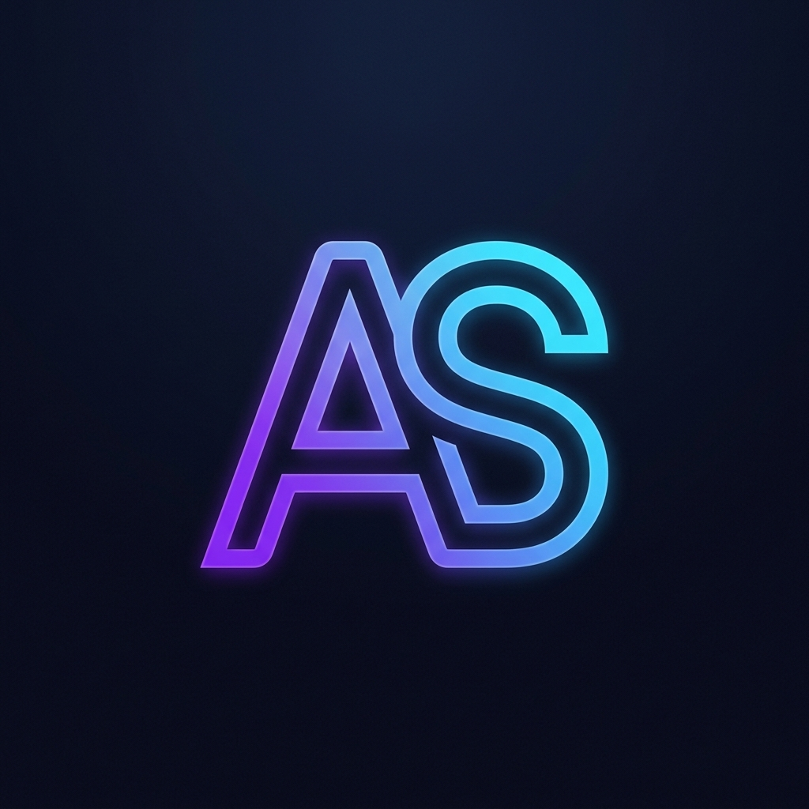

<div align="center">
  <!-- Opcional: Reemplaza esta línea con un banner/imagen si tienes uno -->
  <!--  -->

  <h1>👋 ¡Hola! Soy Alfredo Segura Vara</h1>
  <h3>Desarrollador de Software | Laravel • Backend • Frontend | Flutter</h3>
  
  <p>Construyendo soluciones escalables y experiencias digitales modernas.</p>

  <a href="https://linkedin.com/in/alfredoseguravara" target="_blank">
    
  </a>
  <a href="mailto:pixxo2010@gmail.com">
    
  </a>
  <a href="https://alfreditosv.com" target="_blank">
    
  </a>
</div>

---

## 👨‍💻 Sobre Mí

Con más de **3 años de experiencia**, soy un Desarrollador de Software especializado en el ecosistema **Laravel** (PHP) y desarrollo de aplicaciones móviles multiplataforma con **Flutter**. 

Mi enfoque abarca todo el ciclo de vida del desarrollo: desde el modelado de la arquitectura hasta la configuración de servidores y el despliegue final. Disfruto construyendo sistemas multi-tenant, plataformas de comercio electrónico y automatización de procesos internos.

### 🌟 Lo que me diferencia:
* **Habilidades completas (End-to-End):** No sólo escribo código; planifico bases de datos, coordino equipos, diseño la UI/UX y gestiono la infraestructura (GCP, VPS, Nginx).
* **Solidez Backend:** Fuerte dominio de desarrollo y consumo de APIs REST, autenticaciones avanzadas y seguridad de la información.
* **Adaptabilidad & IA:** Integro herramientas modernas y Agentes de IA en mi flujo de desarrollo para maximizar eficiencia y crear soluciones estructuradas vanguardistas.

---

## 🛠 Stack Tecnológico

>**Backend:** Laravel, PHP, MySQL, REST APIs (Postman). <br>
>**Frontend:** JavaScript, Livewire, Alpine.js, Tailwind CSS, Bootstrap, jQuery, Astro.<br>
>**Móvil:** Flutter, Dart.<br>
>**DevOps e Infraestructura:** Apache, Nginx, Google Cloud Platform (GCP), Laravel Cloud, Git, Linux.<br>

---

## 🏆 Experiencia Destacada

1. **Tu Hogar Con Sentido** *(Programador y Coordinador de Proyectos)*
   - Arquitectura, desarrollo y despliegue de E-commerce y aplicaciones móviles (Laravel + Flutter).
   - Coordinación técnica de equipos y gestión de servidores en la nube.
2. **Movemini** *(Programador Fullstack)*
   - Desarrollo de módulos, despliegue de páginas web y mantenimiento de software a nivel empresarial.
3. **Proyectos Independientes (Freelance)**
   - Plataforma Teatral (The Cultural Concierge)
   - API de Integración de Inventarios con control de stock y Webhooks.

---

## 🚀 Sobre este Portafolio

Este proyecto resguarda no sólo mi experiencia, sino mis estándares en calidad de diseño web.
Está construido bajo un enfoque moderno y modular utilizando:
- **Astro:** Para la generación de un sitio estático estúpidamente rápido.
- **Glassmorphism UI:** Diseño estético 2026 empleando Vanilla CSS sin frameworks pesados.
- **Micro-interacciones:** Lógica en JavaScript puro para efectos visuales elegantes (Background Particles, Cursor Tracking). 

### Correr localmente
Si eres un dev inspeccionando este código, puedes arrancar el portal fácilmente:

```bash
# 1. Instala las dependencias
npm install

# 2. Inicializa el servidor dev de Astro
npm run dev
```

---
<div align="center">
  <p>¿Tienes un proyecto en mente o buscas un perfil sólido para tu equipo?</p>
  <b>¡Hablemos y hagámoslo suceder! 🚀</b>
</div>
